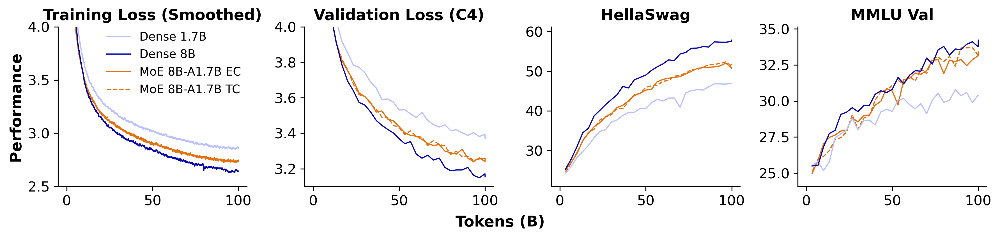

<div align="center">

<!-- TITLE -->
# **OpenMoE 2: Sparse Diffusion Language Models**

[](https://jinjieni.notion.site/OpenMoE-2-Sparse-Diffusion-Language-Models-277d8f03a8668065a4ecd23f23bd6aac?source=copy_link)
[]()


[Jinjie Ni](https://jinjieni.github.io/) and the team

<!-- †Correspondence to: Jinjie Ni \<jinjieni@nus.edu.sg\> -->
</div>

<p align="center" width="100%">

</p>

*Benchmarking FLOPs-matching and parameter-matching dense DLMs with expert-choice and token-choice SDLMs. All training settings are strictly the same except the model size and architectures.*


<br>

# Highlights
Diffusion language models (DLMs) offer several key advantages over autoregressive (AR) models. Their parallel decoding scheme enables certain commercial DLMs to generate thousands of tokens per second, achieving substantially lower latency in practical applications compared to AR models. In addition, they also demonstrated strong performance in coding and mathematical reasoning tasks, likely attributable to their higher compute-to-parameter ratio. Notably, previous work shows that DLMs possess greater data efficiency than AR models in low-data regimes—so-called "intelligence crossovers"—highlighting a fundamental advantage of DLMs under data constraint.

Considering these advantages, we aim to establish a principled scaling path for DLMs to further extend their capability frontier. In this work, we present **OpenMoE 2**, the first systematic study of pre-training sparse diffusion language models (SDLM) from scratch for parameter scaling. We demonstrate that **DLMs can be scaled effectively through sheer parameter expansion without increasing compute, offering a way to flexibly adjust the compute-to-parameter ratio when scaling up.**

Moreover, diffusion and MoEs form a **double-win combination** on repeated data: SDLM consistently beats the FLOPs-matching dense DLM and all AR models, while the AR MoE performs the worst among all AR counterparts. A strictly controlled experiment gives a striking conclusion: **models with a low compute-to-parameter ratio, such as AR MoEs, perform exceptionally poorly on repeated data**, worse than both their FLOPs-matched and parameter-matched dense counterparts. In contrast, MoEs trained with diffusion objective avoid this issue, benefiting from **a high and tunable compute-to-parameter ratio.**

Importantly, SDLM inherently supports **expert-choice routing**, enabling higher throughput, adaptive computation, and perfect load balancing without auxiliary objectives.

We further conduct extensive ablations on architectural design choices, yielding insights that inform our final scaling strategy (TBD).

<br>


# Todo List

**This is an on-going project! We will tick the below todo list one-by-one.**

- [x]  Architectural Design Choices
- [ ]  Scaled-up Pre-training
- [ ]  Post-training
- [ ]  Routing & Other Analysis
- [ ]  Full Paper
- [ ]  Code & Checkpoint Open-sourcing


<br>

# Citation
```
@misc{ni2025openmoe2,
title={OpenMoE 2: Sparse Diffusion Language Models},
author={Ni, Jinjie and team},
year={2025},
howpublished={\url{https://jinjieni.notion.site/OpenMoE-2-Sparse-Diffusion-Language-Models-277d8f03a8668065a4ecd23f23bd6aac}},
note={Notion Blog},
}
```
